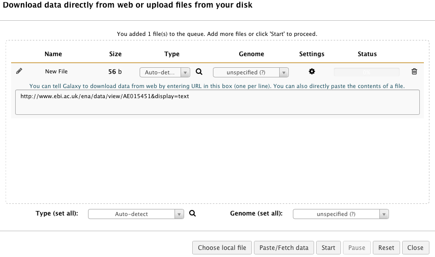
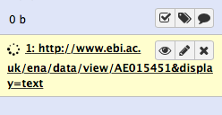
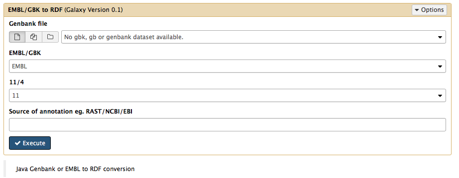
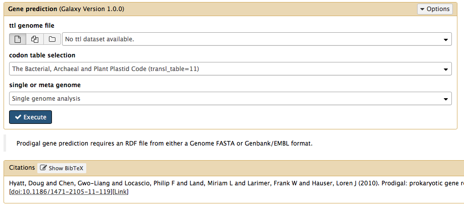

Galaxy
------

Welcome to the Semantic Annotation Pipeline with Provenance (SAPP). This platform has been developed using semantic technologies and the backend is using the RDF framework and SPARQL as query language.

For more information regarding RDF I would advise you to look into JENA and for SPARQL into http://learningsparql.com

The platform has been designed from a bacterial point of view. However it possible to use most of the modules for higher organisms. However with very large genomes (100+ megabases) this platform has not been thoroughly tested and might cause dramatic reduction of performance.

If you have any further recommendations, comments or requests feel free to contact me at [j...@gmail.com](http://www.google.com/recaptcha/mailhide/d?k=01CL3c1VOwM2lbkzJUidYGIA==&c=WEgy1Yo1owvdNCpMpT3klJBmBglN_OVR4lm86ZXtXk0=)

Upload module
-------------------

This platform can be used for the annotation of fasta (gene, protein, genome) and EMBL/GenBank files.

For this tutorial I have selected the organism Pseudomonas putida KT2440 from the EBI website

Through the site you can obtain the "text" link which can be directly loaded into Galaxy .  Then click on the Paste/Fetch data and place the URL in the text box.

[http://www.ebi.ac.uk/ena/data/view/AE015451&display=text]()

The file will become available in the galaxy workflow system on the right:

EMBL/GenBank files
------------------

When you have loaded the EMBL file click on the module on the left to convert it to an RDF database SAPP Conversion > EMBL/GBK to RDF

> Note: By clicking on the button this tutorial will be replaced by the input box. If you want to go back to the tutorial click on the Galaxy/SAPP logo on the top left of your window.

 

If you are new to the Galaxy environment all modules and workflows are build up by first selecting the input file and optionally select specific features required for certain modules.

This module translates EMBL or Genbank files to our self-defined genome ontology. It is designed in a dynamic manner generating an RDF database based on the features annotations of the original file.

After conversion to an RDF database the file can be viewed as plain text or loaded into RDF capable databases such as JENA (which is used for loading the files into each SAPP module) or BlazeGraph and others.

> Converting a Genbank or EMBL file to RDF allows you to query the data files in an intuitive manner. Multiple genomes can be converted and compared through SPARQL.

Genetic elements
-----------------

After the conversion of the EMBL file to RDF, the original genome can be re-annotated using all kinds of modules. Genes, rRNAs, tRNAs, Crispr features can be predicted beside the already existing genes found in the original EMBL file.

To for example predict genes with Prodigal and eventually to compare the results with the original genes present the following module can be used:

**SAPP Genetic Elements > Gene prediction**

 

First the RDF file is selected of a converted genome on which gene prediction needs to be performed. Then the codon table either 4 or 11 (default) can be selected and wether it is a metagenomic or single genome sample.

Fasta to RDF
------------

Another option is to translate fasta files into the RDF format using the fasta module in the conversion tab. These files can be either gene, protein or genome fasta files and maintain the same structure as the EMBL/Genbank conversion making it possible to merge multiple RDF files into a single database and/or use them for other modules.

**After the conversion of either EMBL/Genbank or fasta to RDF the modules explained below can be used further. Needless to say is that when a genome fasta file is converted to RDF protein annotation can only be performed after the gene calling module. Gene or Protein fasta files can of course be directly further annotated using those modules but genetic element prediction tools are then not working as the genome sequence is not present....
**
