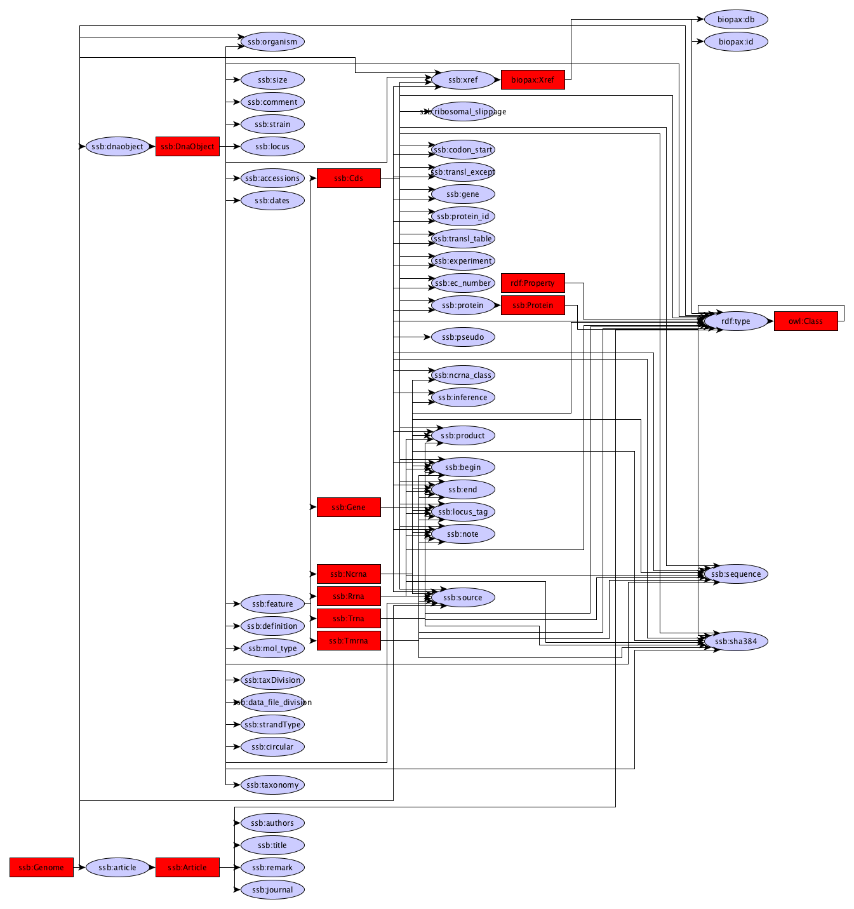

EMBL 2 RDF
------------

The EMBL 2 RDF module is capable of converting EMBL flatfiles files to the GBOL RDF format. 

Source code
-----------
* [GitLab](https://gitlab.com/sapp/conversion)

Command line
------
    java -jar conversion-0.0.1-jar-with-dependencies.jar -embl2rdf
    
	    -embl2rdf
	       EMBL to RDF conversion
	       Default: true
	  * -i, -input
	       Genome in the Flatfile format including sequences
	  * -o, -output
	       Output file in HDT GBOL format
	  * -u, -uniqueidentifier
	       Unique identifier for your sample (e.g. GCA_000001
	
	  * required parameter

Galaxy
------

Structure
---------

In theory there are an infinite possibilities of how the graph structure looks like as the flatfiles can be annotated in various ways. For this image we have used *Pseudomonas putida kt2440*, loaded it through the Galaxy interface and reconstructed the structure.

