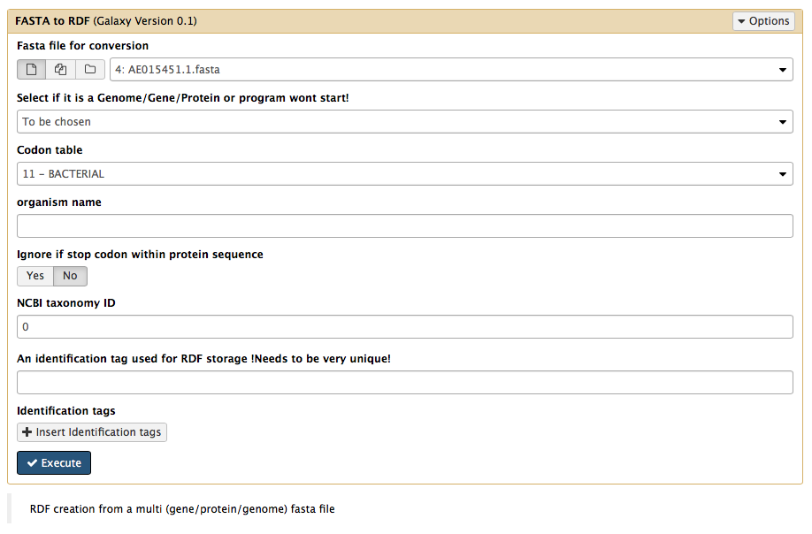
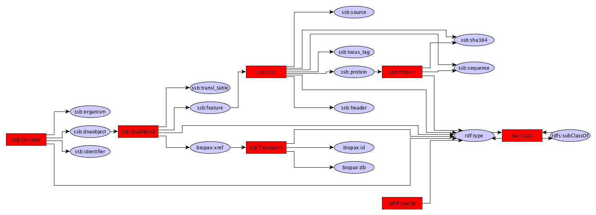
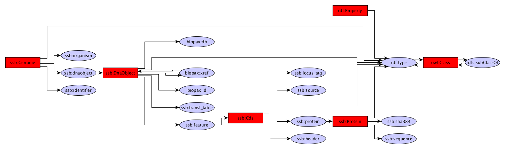
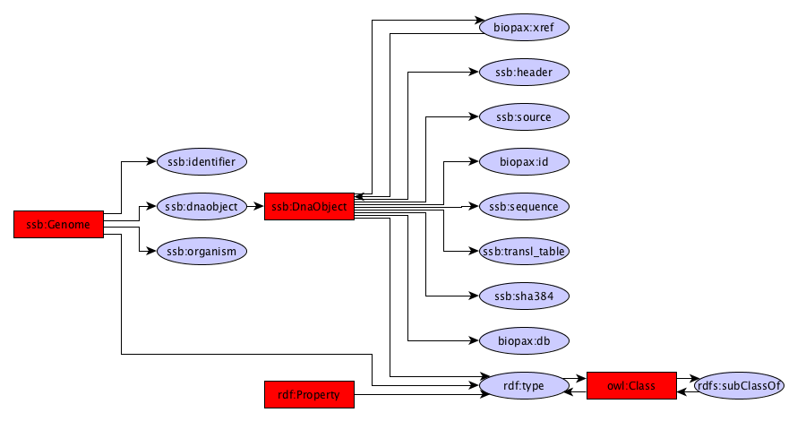

Fasta 2 RDF
------------

The FASTA 2 RDF module is capable of converting Gene/Protein/Genome FASTA files to the SAPP RDF format. 

Source code
-----------
* [GitLab](https://gitlab.com/sapp/conversion)

Command line
------

	java -jar conversion-0.0.1-jar-with-dependencies.jar -fasta2rdf
		
		Usage: <main class> [options]
	  Options:
	    --help
	       
	    -chromosome
	       Genome fasta file consists of complete chromosomes
	       Default: false
	    -codon
	       Codon table used for translating the genes
	       Default: 0
	    -contig
	       Genome fasta file consists of contigs
	       Default: false
	    -debug
	       Debug mode
	       Default: false
	    -fasta2rdf
	       Fasta to RDF conversion
	       Default: true
	    -gene
	       Fasta file consists of genes
	       Default: false
	    -genome
	       Fasta file consists of genome sequences
	       Default: false
	  * -id, -identifier
	       Unique identifier for your sample (e.g. GCA_000001
	  * -i, -input
	       input FASTA file
	  * -org, -organism
	       Organism name
	  * -o, -output
	       output file in HDT GBOL format
	    -protein
	       Fasta file consists of proteins
	       Default: false
	    -scaffold
	       Genome fasta file consists of scaffolds
	       Default: false
	    -stopcodon
	       Will not raise an exception when stop codons are detected during
	       translation
	       Default: false
	    -translate
	       Translate the input sequence to protein
	       Default: false
	
	  * required parameter

Galaxy
------
A galaxy wrapper is included in the project. It requires a FASTA file as input file. Through a drop-down menu you can select wether it is a genome / protein or gene fasta file. 

A codon table can be supplied which allows you to translate gene sequences directly into protein sequences. The name of the organism and its NCBI taxonomy ID can be provided. 

Due to various reasons, stop codons, may be present within automatically translated protein sequences. By default it will raise an exception but this can be overruled through the **ignore if stop codon within protein sequence** option. 

If you want each conversion to have a unique identifier this can be given in the end. Additional identification tags can also be provided if required.

Structure
---------

There are 3 different RDF structures possible (with a large overlap) depending on the input files.

**Gene**

**Protein**
=======

**Genome**
======
