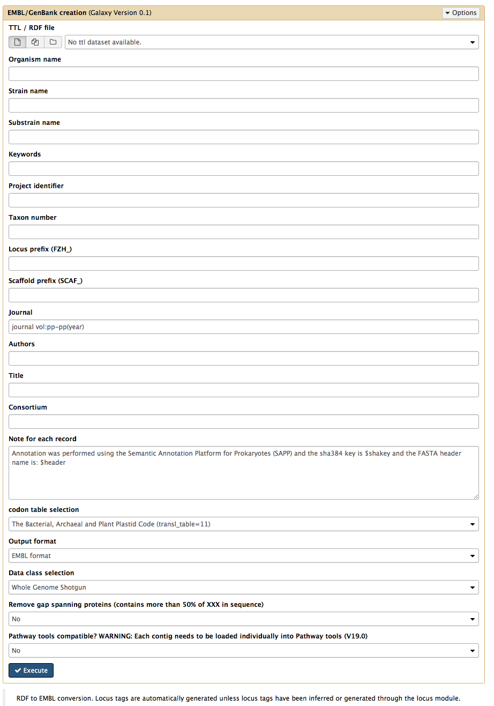

RDF 2 GenBank / EMBL
------------

The RDF 2 GenBank / EMBL module is capable of converting the annotated RDF file towards the GenBank or EMBL format.

Source code
-----------
* [GitLab](https://gitlab.com/sapp/rdf2embl)

Command line
------

	java -jar conversion-0.0.1-jar-with-dependencies.jar -rdf2embl
	
	Usage: <main class> [options]
	  Options:
	    --help
	       
	  * -i, -input
	       input file (HDT - annotated by SAPP / GBOL).
	  * -o, -output
	       output embl file
	  * -rdf2embl
	       Converting HDT/RDF to EMBL
	       Default: true
	
	  * required parameter

Galaxy
------
A galaxy wrapper is included in the project. It requires a RDF file which originated from a genome fasta file. There are a variety of fields to be filled in as can be seen in the figure below.

*Organism name:* A given organism name for the sample

*Strain name:* A given strain name for the sample

*Substrain name:* A given substrain name for the sample

*Keywords:* A list of keys that can be added separated by a comma

*Project identifier:* Identifier for a given project

*Taxon number:* NCBI taxon number

*Locus prefix:* Prefix used for locus tags (e.g. ABC_)

*Scaffold prefix:* Prefix used for each scaffold (e.g. DEF_)

*Journal:* Journal name, volume, pages, year

*Authors:* List of authors involved

*Title:* Title of the article the genome will be published with

*Consortium:* The consortium involved in the project

*Note for each record:* A SAPP template is provided with additional information about contig idenfiers which can be modified after creation.

*Codon table:* The codon table that will be used for the generation of the document

*Output format:* EMBL or GenBank as output format

*Data class selection:* The Whole Genome Shotgun is the most widely used for genome flatfiles

*Gap spanning proteins:* Proteins covering assembly gaps with at least 50% of unknown amino-acids are removed if required.

*Pathway tools compatability:* Pathway tools compatability

