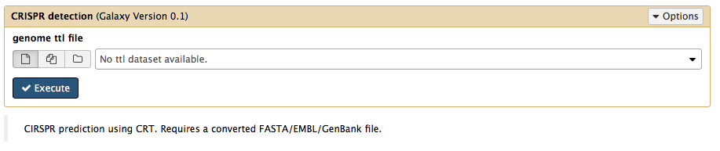

Crispr predictions
------------

The Crispr module uses CRT to identify crispr regions in a given genome

Dependencies
------------
* CRT 1.2.0

Source code
-----------
* [GitLab](https://gitlab.com/sapp/crt)

Galaxy
------
A galaxy wrapper is included in the project. It only requires an RDF file containing a genome sequence.

Structure
---------

