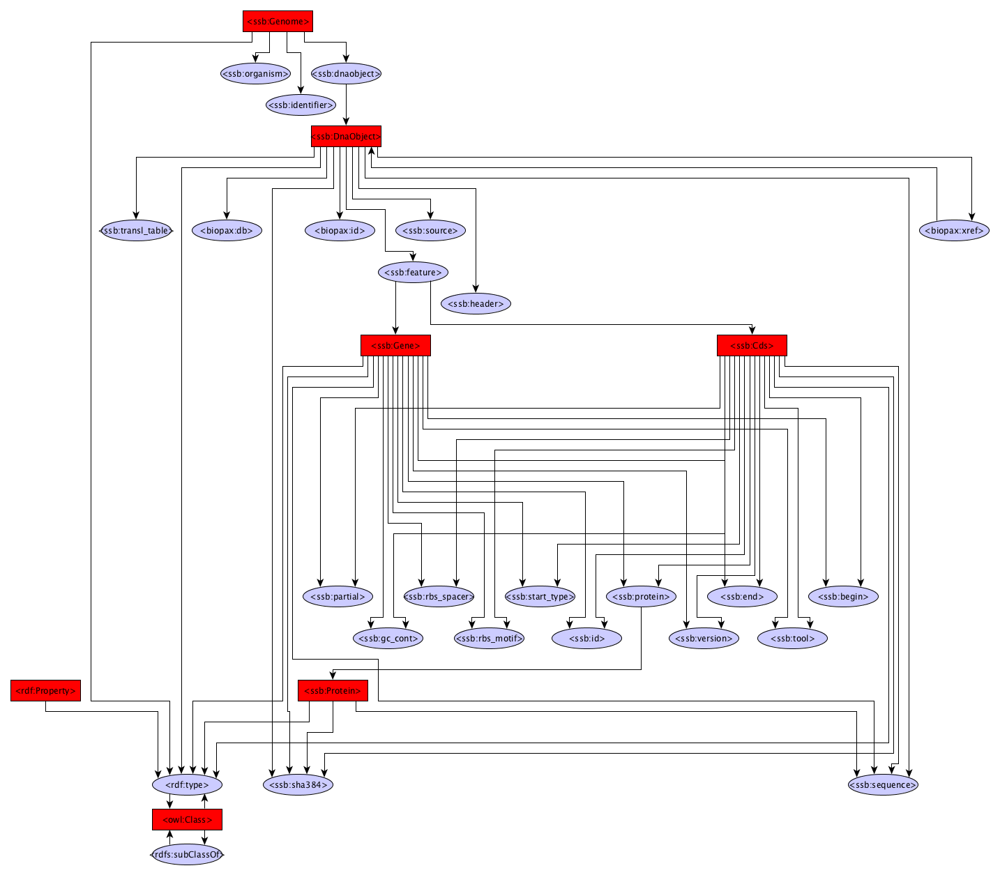

Gene prediction
------------

The Gene Prediction module uses Prodigal or a naive translation method to identify protein coding genes in a given genome

Dependencies
------------
* Prodigal 2.6.3

Source code
-----------
* [GitLab](https://gitlab.com/sapp/genecaller)

Galaxy
------
A galaxy wrapper is included in the project. It only requires an RDF file containing a genome sequence.

Structure
---------

