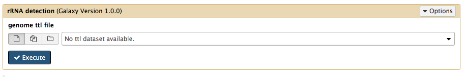
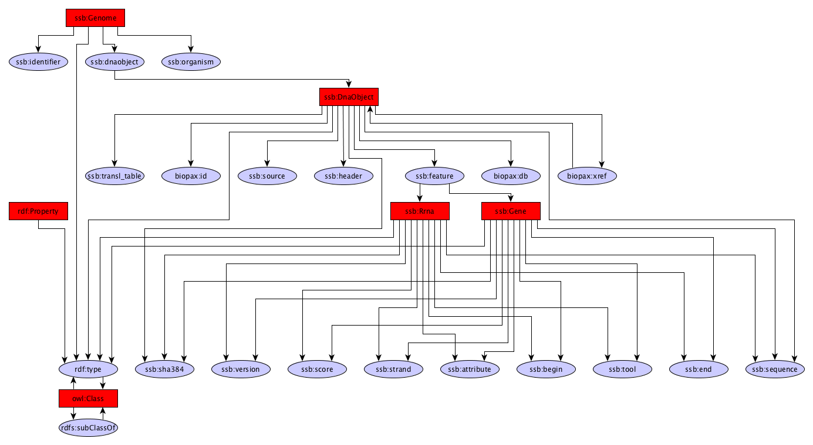

rRNA predictions
------------

The rRNA module uses RNAmmer to identify rRNA genes in a given genome

Dependencies
------------
* RNAmmer 1.2

Source code
-----------
* [GitLab](https://gitlab.com/sapp/rnammer)

Galaxy
------
A galaxy wrapper is included in the project. It only requires an RDF file containing a genome sequence.

Structure
---------

