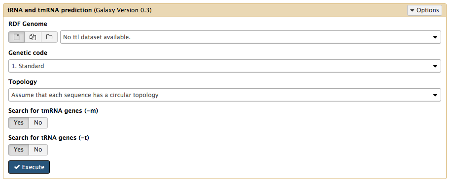
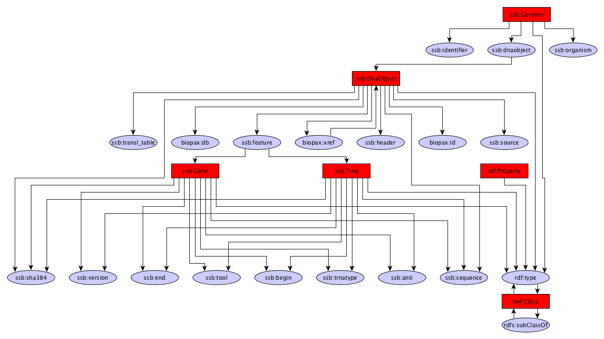

tRNA/tmRNA predictions
------------

The tRNA/tmRNA module uses Aragorn to identify tRNA/tmRNAs in a given genome

Dependencies
------------
* Aragorn 1.2.36

Source code
-----------
* [GitLab](https://gitlab.com/sapp/aragorn)

Galaxy
------
A galaxy wrapper is included in the project. It only requires an RDF file containing a genome sequence.

Structure
---------

