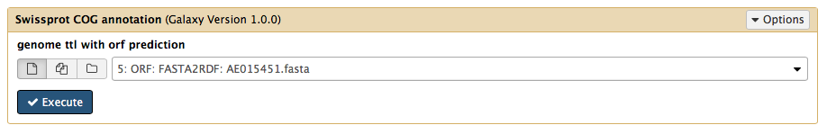
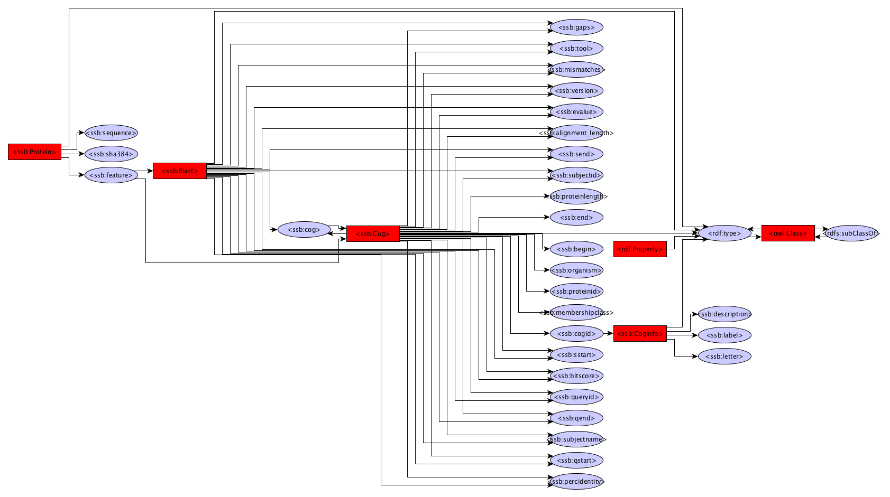

BLAST
------------

The BLAST module uses Diamond to identify protein hits against SwissProt and COG by default and personal diamond databases can be used as well.

Dependencies
------------
* [Diamond](https://github.com/bbuchfink/diamond)
* [COG2014](http://www.ncbi.nlm.nih.gov/pubmed/25428365)
* [SwissProt](http://web.expasy.org/docs/swiss-prot_guideline.html)

Source code
-----------
* [GitLab](https://gitlab.com/sapp/Blast)

Galaxy
------
A galaxy wrapper is included in the project. It requires an RDF file containing protein sequences. 

Structure
---------
The structure has been trimmed upto the protein class. Look at the FlatFile converter graph or the Gene prediction graph for details below the Protein class.

