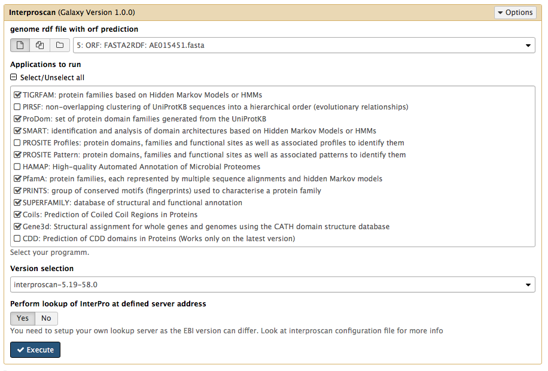
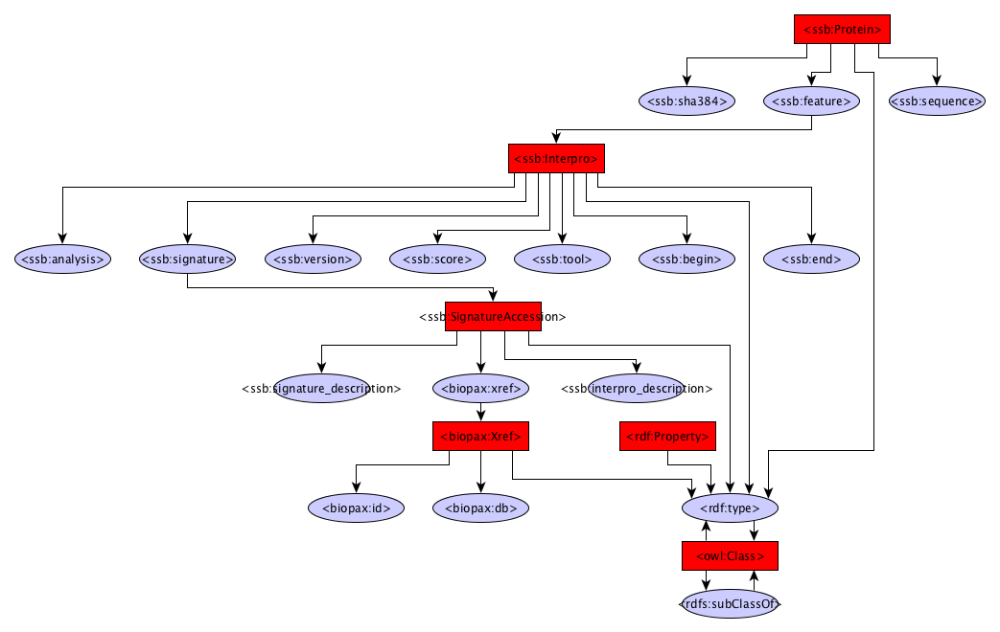

InterPro annotation
------------

The InterPro module uses InterProscan to identify protein domains.

Dependencies
------------
* InterProScan 5.19-58.0

Source code
-----------
* [GitLab](https://gitlab.com/sapp/interproscan)

Galaxy
------
A galaxy wrapper is included in the project. It  requires an RDF file containing protein sequences. These proteins can be predicted from the Gene prediction module or from a converted gene or protein fasta file. By default 4 modules are turned off. PIRSF, PROSITE and HAMAP are found to take a considerable amount of time and can increase the analysis time by a hours. 

When multiple versions are installed a different version can be selected from the galaxy interface.

It is also possible to set up or use the EBI lookup service. If you use an older version it can be useful to set up your own and modify the interproscan file as this can speed up your analysis considerably.

Structure
---------

