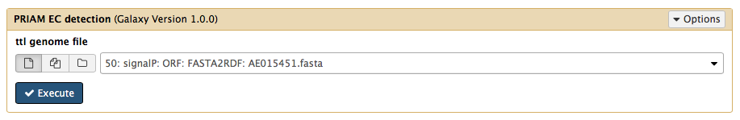
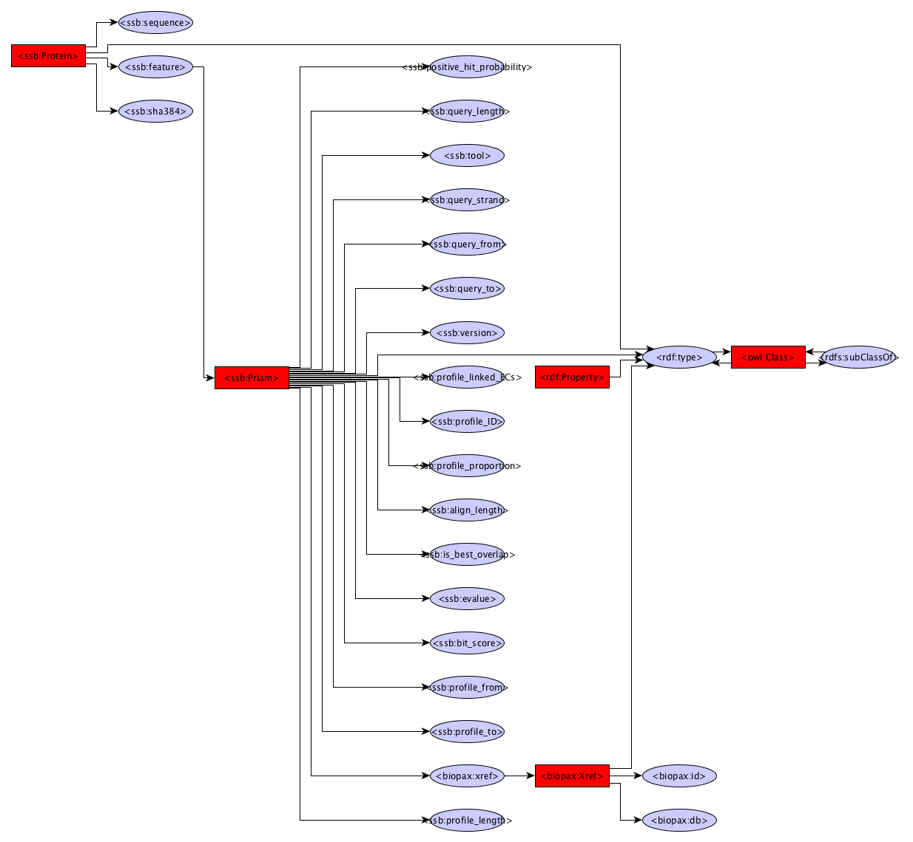

Priam annotation
------------

The Priam module uses Priam Search to identify protein hits against the Priam database

Dependencies
------------
* Priam release March 15
* Priam search 2.0.0

Source code
-----------
* [GitLab](https://gitlab.com/sapp/priam)

Galaxy
------
A galaxy wrapper is included in the project. It requires an RDF file containing protein sequences. 

Structure
---------
The structure has been trimmed upto the protein class. Look at the FlatFile converter graph or the Gene prediction graph for details below the Protein class.

