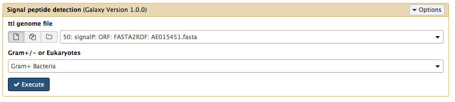
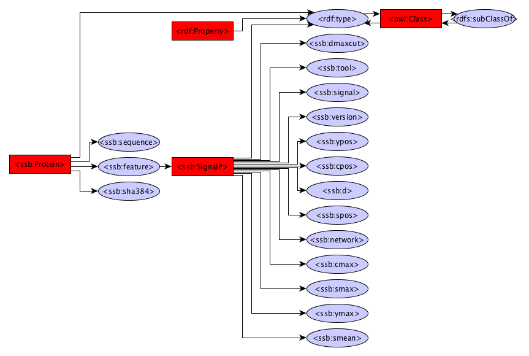

Signal Peptide prediction
------------

The SignalP module uses SignalP  to identify signal peptides in protein sequences.

Dependencies
------------
* SignalP 4.1

Source code
-----------
* [GitLab](https://gitlab.com/sapp/signalp)

Galaxy
------
A galaxy wrapper is included in the project. It requires an RDF file containing protein sequences and in the drop down menu the right type of organism can be selected (Gram+/- or Eukaryote). 

Structure
---------
The structure has been trimmed upto the protein class. Look at the FlatFile converter graph or the Gene prediction graph for details below the Protein class.

