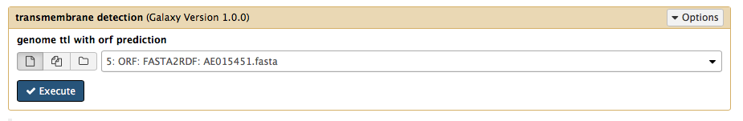
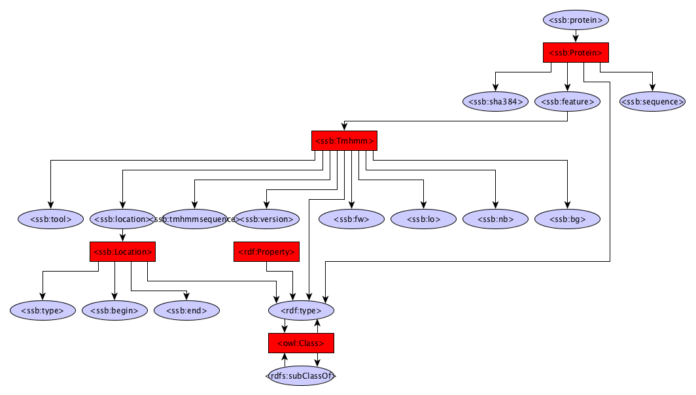

Transmembrane prediction
------------

The transmembrane module uses TMHMM to identify transmembrane regions in protein sequences.

Dependencies
------------
* TMHMM 2.0c

Source code
-----------
* [GitLab](https://gitlab.com/sapp/tmhmm)

Galaxy
------
A galaxy wrapper is included in the project. It requires an RDF file containing protein sequences. 

Structure
---------
The structure has been trimmed upto the protein class. Look at the FlatFile converter graph or the Gene prediction graph for details below the Protein class.

