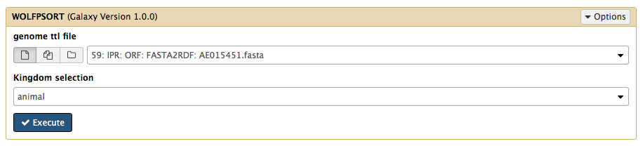
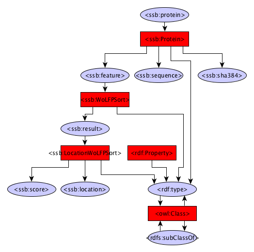

Location prediction
------------

The Location module uses WoLFPsort to identify protein localization

Dependencies
------------
* [WoLFPSORT](https://github.com/fmaguire/WoLFPSort)

Source code
-----------
* [GitLab](https://gitlab.com/sapp/WoLFPSort)

Galaxy
------
A galaxy wrapper is included in the project. It requires an RDF file containing protein sequences and in the drop down menu the right type of organism can be selected (Animal, Plant, Fungi). 

Structure
---------
The structure has been trimmed upto the protein class. Look at the FlatFile converter graph or the Gene prediction graph for details below the Protein class.

